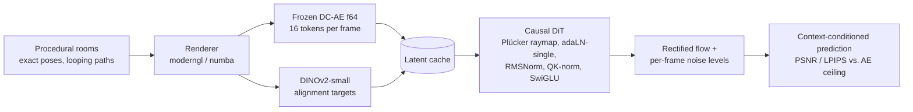

# nanoWM — A Pose-Conditioned Causal Diffusion Transformer World Model

nanoWM is a 40M-parameter world model that predicts future video frames of a 3D
scene from past frames and a camera trajectory. It is a frame-causal Diffusion
Transformer operating in the latent space of a frozen autoencoder, conditioned on
camera pose through Plücker ray maps, trained with rectified flow and per-frame noise
levels (diffusion forcing), and equipped with a KV-cache and frustum-overlap retrieval
for autoregressive rollouts. The design follows the RTFM family of world models at a
scale that trains on two Tesla T4 GPUs.

The model was built and trained under a fixed budget of 20 GPU-hours. Its training
recipe — representation alignment against DINOv2 features and the Muon optimiser —
was chosen by a paired, equal-compute ablation rather than adopted from the
literature. This document describes the architecture, the data, the training
procedure, the evaluation on unseen scenes, and the measurements behind each design
decision.

**Headline numbers.** Given 8 context frames and the camera poses of the next 8, the
model predicts those frames at **37.0 dB PSNR / 0.025 LPIPS on training scenes** and
**21.2 dB / 0.345 on scenes it has never seen**, against an autoencoder ceiling of
46.0 dB. Camera-pose conditioning generalises to new rooms; objects that were not
visible in the context frames are hallucinated rather than recovered. Training the
final model took 1.85 GPU-hours (25 000 steps); the whole project, including the
ablation and one failed attempt, took 10.3.

---

## 1. Architecture



**Latent space.** Frames are rendered at 256 × 256 px and encoded by a frozen DC-AE
(f64, 128 channels) into a 4 × 4 grid of 16 tokens per frame. This autoencoder was
selected over two alternatives by a reconstruction study on a fixed frame set
(§4.1); its 46.0 dB PSNR / 0.0043 LPIPS is the ceiling for everything downstream.

**Backbone (`src/model/`).** A Diffusion Transformer with frame-causal attention:
tokens of frame *t* attend to all tokens of frames ≤ *t*, and bidirectionally within
a frame, so the same weights serve training on 16-frame windows and autoregressive
generation. Blocks use RMSNorm, QK-normalisation, SwiGLU feed-forward layers and
adaLN-single modulation. The final model uses dim 512, depth 12, 16 heads
(40.6M parameters); 5M and 15M presets share the code and were used for the
learning-rate and ablation studies. Parameter count is independent of tokens per frame
and context length.

**Camera conditioning.** Each frame's camera pose and intrinsics are converted to a
Plücker ray map at the token grid's resolution, encoded by a small MLP and added to
the patch embeddings token by token, so every token knows the ray it looks along. The
per-frame diffusion timestep enters separately through adaLN-single modulation, which
is zero-initialised so that the conditioning path starts as an exact identity (an
fp16 stability measure). A local diagnostic confirmed that perturbing one
frame's pose changes that frame's prediction by roughly four times the perturbation
magnitude and leaks nothing into earlier frames, i.e. the conditioning is live and
the causal mask exact.

**Diffusion forcing.** Every frame in a training window carries its own rectified-flow
timestep drawn independently in [0, 1). At inference, context frames are held at
t = 0 while future frames are integrated from noise; this is in-distribution for the
model and needs no separate conditioning mechanism.

**Rollout machinery.** A per-layer KV-cache and a frustum-overlap retrieval module are
implemented for long autoregressive rollouts with spatial memory; the evaluation
reported here uses windowed prediction (§3), and the long-horizon protocol is future
work.

## 2. Data and training

**Data (`src/data/`).** All scenes are procedural: rooms of 5–15 flat-shaded
primitives, deterministic per seed, traversed by closed-circuit and out-and-back
camera trajectories so that revisits are possible. Poses are exact by construction;
no real dataset is used, so no pose noise enters the training signal. The training set
is 40 rooms × 4 trajectories of 32–128 frames (160 trajectories), rendered once,
encoded once, and cached together with DINOv2-small features. Evaluation rooms are
generated from seeds far outside the training range.

**Objective.** Rectified-flow velocity prediction on the latents, plus a
representation-alignment (REPA) term that aligns an intermediate layer (depth / 3)
with the frozen DINOv2 features through a small projection head, weight 0.5. The
head lives inside the model's forward pass so that its gradient is synchronised under
DDP.

**Optimisation.** Muon (Newton–Schulz orthogonalised momentum, fp32) on all matrix
parameters at learning rate 0.02, AdamW at 3e-4 on the rest; 200 warm-up steps and a
cosine decay to 10 % over the planned horizon; gradient clipping at 1.0; fp32 EMA of
the weights (decay 0.999) used for all evaluation; fp16 autocast with a GradScaler
whose growth interval is set high enough that the scale does not drift upward over a
run — an earlier configuration reproducibly overflowed near step 6 000. A NaN watchdog
skips non-finite steps; a throughput watchdog aborts a run, checkpointing first, if
its step rate falls below 30 % of the profiled rate.

**Infrastructure.** DDP, checkpoint/resume that survives SIGTERM, `torch.compile`
(mandatory on T4: 1.2–2.6× faster and up to 40 % less VRAM), a budget ledger in which
every run — successful or not — appends one line, and a ticket guard that refuses to
start a run whose approved duration exceeds the remaining allocation. The 40M model
trains at 3.9 steps/s on a single T4 at batch 8 and 1.35 GB of GPU memory.

**Final training run.** 25 012 steps in 1.85 GPU-hours on one T4, training objective
0.55 → 0.12, memory flat, 43 fp16 steps skipped by the GradScaler. A first attempt
under `torch.compile(mode="reduce-overhead")` with checkpointing died after 3.4
GPU-hours of an out-of-memory error accompanied by a throughput collapse after its
first checkpoint save; the rerun used inductor's default mode and the watchdog above.
The cause is inferred rather than observed (§5).

## 3. Evaluation

**Protocol (`scripts/run_m4_eval.py`).** For each 16-frame window, the first 8 frames
are given to the model as clean latents at t = 0 together with all 16 camera poses;
the remaining 8 frames are integrated from noise with 50 Euler steps and decoded.
PSNR and LPIPS are computed on the predicted frames only. Four held-out rooms (seeds
1000–1003, 64 frames each, 16 non-overlapping windows) measure generalisation; four
trajectories of a training room (12 windows) give the reference.

| split | windows | PSNR mean | PSNR min window | LPIPS |
|---|---|---|---|---|
| held-out rooms | 16 | **21.16 dB** | 13.76 | **0.345** |
| training rooms | 12 | **37.01 dB** | 27.15 | **0.025** |
| autoencoder ceiling | — | 46.01 dB | — | 0.0043 |

PSNR by prediction horizon (+1 … +8 frames after the context): held-out 21.1, 20.3,
17.7, 21.6, 25.4, 19.7, 19.0, 24.5; training 35.5, 32.6, 33.6, 37.3, 38.8, 38.1, 37.9,
42.4. There is no monotone degradation with horizon inside a window on either split;
the held-out variance is dominated by which window is predicted, not by how far ahead.

**Qualitative behaviour.** The grids in `results/m4_eval/` (row 1 ground truth, row 2
prediction, context frames dimmed) show what the numbers mean. On training rooms the
model reproduces wall geometry, camera motion and object placement almost to the
autoencoder ceiling (best windows 47 dB). On unseen rooms it reproduces the room
layout and the camera motion correctly but invents the objects that enter the view
after the context frames: wrong colour, wrong shape, approximately the right position.
The 16 dB gap between the splits is memorisation of the 40 training rooms, not a
pipeline defect; it is the expected behaviour of a 40M model trained for 25k steps on
a small procedural distribution.

## 4. Design decisions and their measurements

Every component choice above was either measured directly or taken by an explicit,
recorded decision. The code and ledger label the project phases M0–M5; the
descriptive names are used here.

### 4.1 Autoencoder (`results/m0_ae_ceiling.json`)

Measured on 2× T4 on 200 fixed rendered frames:

| candidate | tokens/frame | PSNR mean | PSNR min | LPIPS mean |
|---|---|---|---|---|
| DC-AE f32 (SANA) @ 128 px | 16 | 40.68 dB | 29.38 dB | 0.0079 |
| **DC-AE f64 (ImageNet) @ 256 px** | **16** | **46.01 dB** | **35.25 dB** | **0.0043** |
| DC-AE f32 (SANA) @ 256 px | 64 | 44.29 dB | 34.78 dB | 0.0045 |

The reconstruction-trained autoencoder beat the diffusion-backbone-trained one at a
quarter of the tokens. The T4 profile (`results/profile_2xt4_v2.json`) additionally
ruled out 256 tokens per frame — the 40M model does not fit at batch 8 — which
excluded SD-VAE at 256 px.

### 4.2 Learning-rate transfer (μP)

A source-equivalent μP implementation (MuReadout forward multiplier, 1/d_head
attention, fan-in-derived learning-rate groups over the actual proxy/target shapes)
was swept on a same-depth 5M/15M pair (`results/m2_lr_sweep.json`: 5 rates × 2
widths, 3 000 steps, single seed, 0.40 GPU-h). The best base rates were 3e-3 and 1e-2,
a ratio of 3.3 against μP's prediction of ≈ 1, but the top two candidates of each
width differ by under 1.5 % in loss and sit on adjacent points of a 3.16×-spaced grid,
which a single-seed sweep cannot resolve. Transfer was accepted by decision with that
caveat recorded. μP is not used in the final model because it is not composed with
Muon (their interaction is untested and would have confounded the optimiser
comparison).

### 4.3 Representation alignment and optimiser (`results/m3_ablation.json`)

**Protocol.** REPA on/off × Muon vs. AdamW at 15M parameters, two seeds, paired on
seed, data order and initialisation, ranked on the flow-matching term only, at equal
wall-clock per arm (1 800 s) with a per-arm cosine horizon derived from measured
throughput. Muon costs ~44 % of throughput on a T4 and REPA's head ~8 %
(`results/m3_profile.json`), so the Muon arms complete about 55 % of the AdamW arms'
steps in the same time; that cost is charged, not normalised away. Muon's learning
rate was fixed at 0.02 by a 600-step probe (0.005 → 0.503, 0.02 → 0.460, 0.05 →
0.469 with one skipped step).

**Result** (3.76 GPU-h, every arm completing its schedule). Trailing-200 mean of the
flow term:

| arm | steps | seed 0 | seed 1 |
|---|---|---|---|
| no REPA, AdamW | 28 565 | 0.2902 | 0.2874 |
| REPA, AdamW | 26 252 | 0.2686 | 0.2713 |
| no REPA, Muon | 15 857 | 0.2385 | 0.2384 |
| REPA, Muon | 14 513 | **0.2065** | **0.2103** |

Paired per-seed differences (negative = the treatment lowered the loss); every effect
has the same sign in both seeds and is 5–15× the within-arm seed spread of ≤ 0.004:

| effect | held fixed | seed 0 | seed 1 | mean |
|---|---|---|---|---|
| REPA | AdamW | −0.0215 | −0.0160 | **−0.019** |
| REPA | Muon | −0.0319 | −0.0281 | **−0.030** |
| Muon | no REPA | −0.0517 | −0.0489 | **−0.050** |
| Muon | REPA | −0.0621 | −0.0610 | **−0.062** |

Over the learning curves, Muon leads at every wall-clock checkpoint from 300 s on;
REPA is level with its control until ~600 s and ahead from ~900 s on under both
optimisers.

**Interpretation.** Representation alignment is a clean, replicated effect — 7 % lower
flow loss at equal wall-clock despite its throughput cost, growing over training —
and is part of the final recipe on that basis. The optimiser comparison is not
clean: AdamW's 3e-4 was carried over from the μP sweep, whereas the ablation runs
without μP, so AdamW was compared at an untuned rate against a probed Muon rate. What
is established is that Muon at 0.02 beats AdamW at 3e-4 by 17 % at equal wall-clock
with 55 % of the steps; that it beats a tuned AdamW is not. Muon was kept for the
final model on the strength of the measured lead, with this caveat.

### 4.4 Budget

| phase | allocated (GPU-h) | spent | state |
|---|---|---|---|
| pipeline validation (5M, one scene) | 1.0 | 0.78 | closed |
| learning-rate transfer | 3.0 | 1.17 | closed by decision |
| ablation | 5.0 | 3.86 | complete |
| main run (40M) | 8.0 | 5.28 | complete; 3.43 in the failed first attempt |
| rollout fine-tune | 2.0 | 0 | not started |
| reserve | 1.0 | 0 | — |
| **total** | **20.0** | **10.30** | |

## 5. Limitations

- The model does not generalise scene content to unseen rooms; it generalises camera
  motion and layout. Evaluation is confined to 16-frame windows: the long-horizon
  rollout with revisit metrics that the KV-cache and retrieval modules are built for
  has not been run, nor has a noise-floor calibration of the evaluation.
- The optimiser effect in §4.3 is confounded by an untuned AdamW baseline; only the
  representation-alignment effect is a clean measurement.
- Two seeds per ablation arm is the minimum the protocol allows.
- The learning-rate transfer gate was accepted under a real ambiguity.
- The failed first training attempt's cause is inferred, not observed; the fix removed
  the symptom without confirming the mechanism.
- Flat-shaded procedural rooms are far from any real distribution. This is by design
  (exact poses, no pose noise) and limits external validity.

## 6. Reproduction

```bash
pip install -e .            # torch >= 2.x, numpy; pyyaml for scripts/budget.py
pytest -q                   # 214 tests: shapes, causality, determinism, resume, budget guards, muP, Muon, REPA, eval
python scripts/budget.py status
python scripts/train.py --config configs/smoke_cpu.yaml     # CPU smoke of the full training loop
```

Kaggle runs use the notebooks in `kaggle/` with the source bundled as a dataset; every
run configuration is a versioned YAML in `configs/`. Committed configurations carry
`ticket_hours: null` on purpose and a test enforces it: a concrete ticket is written
only into the Kaggle-side copy after approval, and the runners refuse to start on
unmeasured throughput. The final model's configuration is `configs/m4_main.yaml`; the
evaluation is `scripts/run_m4_eval.py`.

## 7. Repository layout

| Path | Content |
|---|---|
| `src/model/` | causal DiT, blocks, Plücker raymap, diffusion forcing, KV-cache, retrieval |
| `src/train/` | trainer, DDP, AMP, checkpoint/resume, EMA, μP, Muon, REPA, watchdogs, budget |
| `src/data/` | procedural rooms, trajectories, renderer, DINOv2 features |
| `src/eval/` | autoencoder ceiling, sampler, metrics, test-frame protocol |
| `scripts/` | training entry point, evaluation, budget CLI, precompute, per-phase runners |
| `configs/` | one YAML per run |
| `kaggle/` | kernel metadata and notebooks per phase |
| `results/` | measured artefacts: ceilings, profiles, sweeps, the ablation, the main run's diagnosis, plan, log and evaluation grids |
| `budget/` | phase allocation and the append-only run ledger |
| `tests/` | 214 unit tests |
| `CLAUDE.md` | project brief, work rules and the full decision log |

## 8. Licences and provenance

Code: MIT. Two frozen third-party models are downloaded at run time and not
redistributed here: DINOv2-small (`facebook/dinov2-small`, Apache-2.0) and DC-AE
(`mit-han-lab/dc-ae-f64c128-in-1.0-diffusers`; the SANA f32 variant was tried in the
autoencoder study only). The DC-AE *code* (`mit-han-lab/efficientvit`) is Apache-2.0;
the weight repositories on the Hub carry no licence field of their own, so their
status is inherited from the code release rather than stated explicitly. No weights,
features, latents or checkpoints are redistributed, and all training data is
procedurally generated. The one class of artefact that passes through those weights
is stated precisely: the evaluation grids in `results/m4_eval/*.png` are DC-AE
decodes — both the ground-truth row and the prediction row are latents of this
project's own procedurally rendered rooms passed through the frozen DC-AE decoder, and
they depict nothing but those synthetic scenes. SD-VAE was evaluated in the
autoencoder study only and rejected on token count before its licence became
relevant. Method references: RTFM (World Labs), REPA (Yu et al.), Muon (Jordan et
al.), μP (Yang et al., `microsoft/mup`), diffusion forcing (Chen et al.), DC-AE
(Chen et al., MIT HAN Lab), DINOv2 (Oquab et al.).

Developed by one person over three weeks with AI coding agents (Claude) under a
written brief whose central rule is the ledger: no GPU run without a ticket, no
ticket without a profile, no result without its budget.

## 9. Citation

```bibtex
@software{nanowm_2026,
  title  = {nanoWM: A Pose-Conditioned Causal Diffusion Transformer World Model},
  author = {Say43},
  year   = {2026},
  url    = {https://github.com/Say43/World-Model}
}
```
