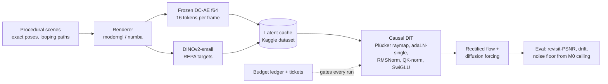

# nanoWM: which training tricks pay off for a 40M-parameter world model in 20 GPU-hours?

A pose-conditioned, autoregressive Diffusion Transformer with frame-causal attention
and spatial memory, in the style of World Labs' RTFM, built at nano scale and run
under a hard budget of **20 GPU-hours on Kaggle's 2× Tesla T4** for the entire project.
The deliverable is the measurement, not the model: which frontier training methods
(REPA, Muon, muP, diffusion forcing) actually pay off at ~15–40M parameters, and by
what factor, when every GPU-second is ticketed and ledgered. This is a speedrun /
ablation project in the modded-nanogpt tradition, not a scaling project.

**Status (2026-09-21).** M0–M4 closed. The M3 ablation ran (§3.6): REPA lowers the
flow loss by 7 % at equal wall-clock, consistently across seeds and optimisers; Muon
beats AdamW-at-3e-4 by 17 % while getting 55 % of the steps, but that comparison is
confounded by an AdamW learning rate that was never tuned without muP, and is
reported as such. The 40M main run (§3.7) exists and was evaluated on held-out
scenes: 21.2 dB PSNR on unseen rooms against 37.0 dB on training rooms and a 46.0 dB
autoencoder ceiling. 10.3 of 20 GPU-hours spent, including one 3.4-hour run that
died of an out-of-memory error and is analysed in the decision log.

## 1. Objective and constraints

The question is deliberately narrow. World-model papers ship with a bundle of training
choices, each individually plausible, none individually costed. At 20 GPU-hours the
bundle cannot be afforded, so the choices have to be measured one at a time, on paired
seeds, at equal compute, or the result is anecdote.

Hard constraints, all of which shaped the code:

- **Hardware:** Kaggle, 2× Tesla T4 (sm75): no bf16, no FlashAttention-2. fp16 AMP
  with GradScaler, a NaN watchdog, Muon's Newton–Schulz in fp32.
- **Sessions:** 12 h hard cutoff; checkpoint/resume must survive SIGTERM.
- **Budget:** 10 wall-clock hours on 2 GPUs = 20 GPU-hours, pre-allocated per
  milestone (`budget/allocation.yaml`). Every training run needs a ticket (duration,
  purpose, expected result, abort criterion) approved before launch and appends to
  `budget/ledger.jsonl`; a run that exceeds its ticket is aborted by the trainer
  itself. Inference (latent precompute, evaluation) is charged to the separate Kaggle
  weekly quota, not to the training budget.
- **Data:** procedural indoor scenes with exact camera poses (5–15 primitives per
  room, deterministic per seed, looping trajectories so that a revisit metric is
  possible), rendered with moderngl or a numpy/numba fallback. No real datasets:
  pose noise would contaminate the ablations.

## 2. System



**Model (`src/model/`).** A causal DiT: tokens of frame *t* attend to all tokens of
frames ≤ *t*, bidirectionally within a frame. Camera pose enters as a Plücker raymap;
conditioning via adaLN-single with zero-initialised modulation so the conditioning
path starts as an exact no-op (an fp16 mitigation, see the module docstring). Every
frame carries its own rectified-flow timestep (diffusion forcing). KV-cache and
frustum-overlap retrieval are implemented for rollouts. Parameter count is
independent of tokens-per-frame and context length, which is what let the
autoencoder decision be taken separately from the model-size gates. Presets: 5M,
15M (dim 320, depth 11), 40M.

**Training (`src/train/`).** DDP, fp16 AMP, NaN watchdog, EMA in fp32, muP
(`mup.py`, source-equivalent to the reference: MuReadout forward multiplier,
`1/d_head` attention, fan-in-derived LR groups over the *actual* proxy/target shapes),
Muon (`muon.py`), REPA alignment head (`repa.py`, applied inside the model's forward
so its gradient is all-reduced under DDP), and a budget guard that refuses tickets
exceeding the milestone or total allocation.

**Evaluation (`src/eval/`).** Autoencoder ceiling, sampler, PSNR/LPIPS, and the
revisit/persistence metric the project was designed to add to the Target-Bench
harness (TUM-AVS, arXiv 2511.17792). Every model number is reported against the M0
ceiling and budget-normalised ("PSNR *x* after *y* GPU-minutes"), never bare.

**Process.** Six narrow-scope agents (data, model, training infrastructure, T4
profiler, evaluation, and a report-only *skeptic* with veto power at every gate) work
from `CLAUDE.md`, which doubles as the decision log; the user approves every ticket.

## 3. Results so far

### 3.1 M0: autoencoder ceiling (measured on 2× T4, `results/m0_ae_ceiling.json`)

| candidate | tokens/frame | PSNR mean | PSNR min | LPIPS mean |
|---|---|---|---|---|
| DC-AE f32 (SANA) @ 128 px | 16 | 40.68 dB | 29.38 dB | 0.0079 |
| **DC-AE f64 (ImageNet) @ 256 px** | **16** | **46.01 dB** | **35.25 dB** | **0.0043** |
| DC-AE f32 (SANA) @ 256 px | 64 | 44.29 dB | 34.78 dB | 0.0045 |

The reconstruction-trained autoencoder beat the diffusion-backbone-trained one on
pure fidelity at a quarter of the tokens. 46.0 dB / 0.0043 is the hard ceiling for
every later number.

### 3.2 T4 profile: what the hardware allows (`results/profile_2xt4_v2.json`)

Steps that fit each milestone, compiled, batch 8:

| tokens/frame | M3 per arm (1.25 GPU-h, 15M) | M4 (8 GPU-h, 40M) |
|---|---|---|
| 16 | 151 873 | 475 091 |
| 64 | 29 479 | 97 889 |
| 256 | 2 639 | OOM |

Three facts that overturned the analytical plan: `torch.compile` is mandatory
(1.2–2.6× speed-up, up to 40 % less VRAM, compiled on sm75 in every configuration);
256 tokens/frame is out of reach, which ruled out SD-VAE at 256 px; and MFU is 4–14 %
everywhere, so these models are launch-overhead-bound and larger batches are worth
more than they would be in a compute-bound regime. fp16 was stable: zero non-finite
losses, zero GradScaler skips.

### 3.3 M1: pipeline verified; flat PSNR diagnosed as a data-diversity artefact

Eight Kaggle attempts were needed to get sampler and evaluation running end to end,
each on a distinct real bug (AE scaling factor, dataset mount timing, `torch.load`
default, `torch.compile` renaming checkpoint keys, context length read from the wrong
axis, a GradScaler growth interval that produced an inf gradient at step ≈ 6 000, a
`fit()` that never checkpointed on normal completion). The ledger keeps all of them.

The 5M model then trained to 8 000 steps with zero NaN events, but reconstruction sat
at **PSNR 13.1 dB / LPIPS 0.61** against the 46.0 dB ceiling, flat across four
checkpoints spanning a 2× step range. A budget-free local diagnostic
(`scripts/diagnose_m1_flat_psnr.py`) showed why, and that it was not the failure the
gate was designed to catch:

- perturbing one frame's pose changes that frame's prediction by ~4× its magnitude
  and leaks exactly nothing into earlier frames: conditioning is live, the causal
  mask is exact;
- one-step denoising near the data manifold is excellent (MSE 0.01 % of a random
  baseline) and degrades toward pure noise (27 % at t = 0.98);
- sampling from noise gives the same latent MSE at 50, 200 and 1 000 Euler steps
  (0.978 / 0.980 / 0.981), so integration accuracy is not the cause.

The learned velocity field is good locally and poor globally, because M1's dataset was
eight repeated windows of one 128-frame trajectory. Conclusion recorded: conditioning
works; do not spend more M1 budget chasing PSNR on that data. 0.78 of 1.0 GPU-hours.

### 3.4 M2: muP learning-rate transfer, ambiguous, accepted by decision

The first muP draft was stopped before touching a GPU because it was not
source-equivalent (depth and head count changed with width, fused QKV omitted from LR
scaling, readout scaled on the wrong side). The corrected same-depth pair, compiled,
zero divergence (`results/m2_profile.json`):

| preset | dim | params | step time | steps / GPU-h |
|---|---|---|---|---|
| m2_proxy_5m | 192 | 5.33M | 15.8 ms | 228 571 |
| 15m (heads = 8) | 320 | 14.80M | 27.7 ms | 130 105 |

Ten-arm sweep, 5 log-spaced LRs × 2 widths, 3 000 steps, single seed, 0.40 GPU-h
(`results/m2_lr_sweep.json`): best LR 3e-3 at dim 192, 1e-2 at dim 320, a ratio of
3.3 against muP's prediction of ≈ 1. But the top two candidates of each width differ
by under 1.5 % in loss and are adjacent points on a 3.16×-spaced grid; a single-seed,
five-point sweep cannot separate "transfer works, noise picked the neighbour" from
"transfer is off by a few ×". Both `lr = 1e-4` arms diverged around step 600,
symmetrically across widths, pointing at a warm-up instability rather than muP. The
gate was **treated as passed by user decision**, with the caveat carried forward in
the decision log: revisit before trusting width transfer if M3/M4 behave in an
LR-sensitive way. 1.17 of 3.0 GPU-hours.

### 3.5 M3-A: pre-flight for the ablation (`results/m3_profile.json`)

The M3 matrix is REPA on/off × Muon vs. AdamW at 15M, two seeds, paired on seed, data
order and init, ranked on the flow loss only (a CPU smoke had reported a "+0.49 REPA
effect" that was purely REPA's own auxiliary term), with **equal wall-clock per arm**
and a per-arm cosine horizon derived from measured throughput, because an arm cut off
long before its `total_steps` trains at near-peak LR throughout (that exact mistake
diverged an M1 run). Rectified flow vs. DDPM was dropped as the axis with the
strongest prior and therefore the least information per GPU-hour.

Measured on a single T4, compiled, 0.10 GPU-h:

| arm | steps/s | relative |
|---|---|---|
| no REPA, AdamW | 17.63 | 1.00 |
| REPA, AdamW | 16.20 | 0.92 |
| no REPA, Muon | 9.79 | 0.56 |
| REPA, Muon | 8.96 | 0.51 |

Muon costs ~44 % of throughput on T4 (fp32 Newton–Schulz on every 2-D matrix every
step); REPA's head costs ~8 %. Under the equal-wall-clock rule the Muon arms get about
55 % of the AdamW arms' steps. That is the price the ablation charges; if Muon still
wins, it wins per GPU-hour, the only unit this project reports in. A 600-step Muon LR
probe bracketed the reference default (0.005 → 0.503, **0.02 → 0.460**, 0.05 → 0.469
with one NaN-skipped step; AdamW at M2's 3e-4 → 0.568), so `muon_lr = 0.02` is set
for M3-B, removing the "tuned AdamW vs. default Muon" bias that the decision log had
flagged. The 19 % loss lead of Muon in that probe is at equal *steps*, before its
throughput cost; M3-B is what settles it.

### 3.6 M3-B: the ablation (`results/m3_ablation.json`, 3.76 GPU-h)

Eight arms, 1 800 s each on one T4, every arm completing its full cosine schedule.
Trailing-200 mean of the **flow** term (REPA's alignment term excluded from ranking):

| arm | steps | seed 0 | seed 1 |
|---|---|---|---|
| no REPA, AdamW | 28 565 | 0.2902 | 0.2874 |
| REPA, AdamW | 26 252 | 0.2686 | 0.2713 |
| no REPA, Muon | 15 857 | 0.2385 | 0.2384 |
| REPA, Muon | 14 513 | **0.2065** | **0.2103** |

Paired per-seed deltas (negative = the treatment helped), all with the same sign in
both seeds; seed-to-seed spread within an arm is ≤ 0.004, every effect is 5–15× that:

| effect | held fixed | seed 0 | seed 1 | mean |
|---|---|---|---|---|
| REPA | AdamW | −0.0215 | −0.0160 | **−0.019** |
| REPA | Muon | −0.0319 | −0.0281 | **−0.030** |
| Muon | no REPA | −0.0517 | −0.0489 | **−0.050** |
| Muon | REPA | −0.0621 | −0.0610 | **−0.062** |

Curves, not endpoints: Muon leads at every wall-clock checkpoint from 300 s on; REPA
is level until ~600 s and ahead from ~900 s on under both optimisers. Three
`diverged_at_step` flags are single fp16 inf/nan-gradient steps skipped by the
GradScaler with no visible effect on the curve.

**REPA: gate passed** — 7 % lower flow loss at equal wall-clock despite an 8 %
throughput cost, growing over training. **Muon: large effect, confounded.** M2 tuned
AdamW's LR *under muP*; M3 ran without muP (Muon and muP are not composed, by
decision) at `adamw_lr = 3e-4`, a default rather than a tuned value, while Muon's LR
*was* tuned by the M3-A probe. The safe statement is that Muon at 0.02 beats AdamW at
3e-4 by 17 % at equal wall-clock with 55 % of the steps; that it beats a *tuned* AdamW
is not established. The two ways to settle it (a 0.1 GPU-h AdamW LR probe, or a
2 GPU-h rerun of the AdamW arms) were offered and declined in favour of the main run.

### 3.7 M4: the 40M main run and its evaluation (`results/m4_eval/`)

Configuration: best M3 arm (REPA + Muon at 0.02), 40M preset, batch 8, one run, no
retuning. The first attempt (8 GPU-h approved in two sessions) died after 3.43 GPU-h
with a CUDA out-of-memory error in which PyTorch's allocator held 1 GB and the process
13.5 GB; only the first checkpoint existed, so throughput had collapsed right after
that save. The mechanism is inferred (CUDA-graph re-recording under
`torch.compile(mode="reduce-overhead")`), not observed — Kaggle does not return logs
of errored kernels — and a 5-minute two-mode diagnosis with checkpoint saves did
*not* reproduce it within 300 steps (`results/m4_diagnosis.json`). The rerun used
inductor's default mode, kept the fp32 EMA on the GPU (a 162 MB PCIe copy per step
was a visible share of the 40M step time), added a throughput watchdog to the trainer
(abort with checkpoint below 30 % of the profiled rate), and was cut to 2.0 GPU-h by
the user: **25 012 steps at 3.9 steps/s, memory flat at 1.35 GB, loss 0.55 → 0.12**,
43 fp16 steps skipped, 1.85 GPU-h.

Evaluation (`scripts/run_m4_eval.py`): the first 8 frames of a 16-frame window are
held clean at t = 0 (in-distribution for diffusion forcing) and the remaining 8 are
integrated from noise with 50 Euler steps; PSNR/LPIPS on the predicted frames only,
EMA weights. Held-out scenes are procedural rooms with seeds far outside the training
range, rendered for the evaluation and never trained on.

| split | windows | PSNR mean | PSNR min window | LPIPS |
|---|---|---|---|---|
| held-out scenes (4 rooms, seeds 1000–1003) | 16 | **21.16 dB** | 13.76 | **0.345** |
| training scenes (room 0, 4 trajectories) | 12 | **37.01 dB** | 27.15 | **0.025** |
| M0 autoencoder ceiling | — | 46.01 dB | — | 0.0043 |

PSNR by prediction horizon +1…+8: held-out 21.1 20.3 17.7 21.6 25.4 19.7 19.0 24.5,
training 35.5 32.6 33.6 37.3 38.8 38.1 37.9 42.4. Within a 16-frame window there is no
monotone drift on either split; the held-out spread is dominated by which window, not
by horizon. The grids in `results/m4_eval/` (row 1 ground truth, row 2 prediction,
context frames dimmed) show what the numbers mean: on training rooms the model
reproduces wall geometry, camera motion and object placement almost to the AE ceiling
(best windows 47 dB); on unseen rooms it gets the room layout and the camera motion
right but invents the objects that enter the view after the context frames — wrong
colour, wrong shape, roughly the right place. That is the honest picture of a 40M model
after 25k steps on 40 procedural rooms: pose conditioning generalises, content that
was never visible in the context cannot, and the 16 dB gap between splits is
memorisation of the training rooms rather than a broken pipeline.

The M4 gate as written (long-horizon revisit-PSNR against ceiling and noise floor) is
only partly answered: window-scale drift is flat, the KV-cache autoregressive rollout
needed for revisits is not implemented, and the noise-floor calibration was never
run. Both are open, not failed.

### 3.8 Budget ledger

| milestone | allocated | spent | state |
|---|---|---|---|
| M1 pipeline / overfit | 1.0 | 0.78 | closed by diagnosis |
| M2 muP transfer | 3.0 | 1.17 | closed by decision |
| M3 ablations | 5.0 | 3.86 | done (§3.6) |
| M4 main run (40M) | 8.0 | 5.28 | done (§3.7); 3.43 of it in the failed first attempt |
| M5 rollout fine-tune | 2.0 | 0 | not started |
| reserve | 1.0 | 0 | |
| **total** | **20.0** | **10.30** | |

## 4. Limitations

- The Muon effect in §3.6 is confounded by an untuned AdamW baseline; only the REPA
  effect is a clean measurement.
- The 40M model does not generalise scene *content* to unseen rooms (§3.7); the
  evaluation is within a 16-frame window, and there is no long-horizon rollout or
  revisit metric yet.
- The failed M4 attempt's cause is inferred, not observed; the fix (no CUDA graphs,
  throughput watchdog) removed the symptom without a confirmed mechanism.
- The M2 gate is a practical call under a real ambiguity, not a statistical pass.
- Two seeds per arm is the minimum the work rules allow; effects inside seed spread
  will be reported as `consistent_sign: false`, not as a mean.
- Procedural scenes with flat-shaded primitives are far from any real distribution;
  this is by design (exact poses, no pose noise) and limits external validity.
- Ledger entries record `git_sha: unknown` for early runs; provenance for those is by
  commit message and date.

## 5. Reproduction

```bash
pip install -e .            # torch >= 2.x, numpy; pyyaml for scripts/budget.py
pytest -q                   # 214 tests: shapes, causality, determinism, resume, budget guards, muP, Muon, REPA
python scripts/budget.py status
python scripts/train.py --config configs/smoke_cpu.yaml     # CPU smoke of the full train loop
```

Kaggle runs use the notebooks in `kaggle/` with the source bundled as a dataset; every
run config is a versioned YAML in `configs/`. The committed M2 and M3 configs carry
`ticket_hours: null` on purpose and a test enforces it: a concrete ticket is written
only into the Kaggle-side copy after approval, and the runners refuse to start on
unmeasured `steps_per_arm`.

## 6. Repository layout

| Path | Content |
|---|---|
| `CLAUDE.md` | project brief, work rules and the full decision log |
| `budget/` | milestone allocation and the append-only run ledger |
| `configs/` | one YAML per run (smoke, M1, M2 sweep, M3 profile, M3 ablation, M4 main) |
| `src/data/` | procedural scenes, trajectories, renderer, DINOv2 features |
| `src/model/` | causal DiT, blocks, Plücker raymap, diffusion forcing, KV-cache, retrieval |
| `src/train/` | trainer, DDP, AMP, checkpoint/resume, EMA, muP, Muon, REPA, NaN watchdog, budget |
| `src/eval/` | AE ceiling, sampler, metrics, test-frame protocol |
| `scripts/` | training entry point, budget CLI, precompute, per-milestone runners, M1 diagnostic |
| `kaggle/` | kernel metadata and notebooks per milestone |
| `results/` | measured artefacts: M0 ceiling, profiles, M1 gate, M2 sweep, M3 pre-flight and ablation, M4 diagnosis, plan, kernel log and evaluation grids |
| `tests/` | 214 unit tests |

## 7. Licences and provenance

Code: MIT. Two frozen third-party models are downloaded at run time and not
redistributed here: DINOv2-small (`facebook/dinov2-small`, Apache-2.0) and DC-AE
(`mit-han-lab/dc-ae-f64c128-in-1.0-diffusers`; the SANA f32 variant was tried in M0
only). The DC-AE *code* (`mit-han-lab/efficientvit`) is Apache-2.0; the weight
repositories on the Hub carry no licence field of their own, so their status is
inherited from the code release rather than stated explicitly. No weights, features,
latents or checkpoints are redistributed here, and all training data is procedurally
generated. The one class of artefact that passes through those weights is stated
precisely: the evaluation grids in `results/m4_eval/*.png` are DC-AE *decodes* — both
the ground-truth row and the prediction row are latents of this project's own
procedurally rendered rooms passed through the frozen DC-AE decoder, and they depict
nothing but those synthetic scenes. SD-VAE was evaluated for M0 only and rejected on
token count before its licence became relevant. Method references: RTFM (World Labs), REPA (Yu et al.), Muon
(Jordan et al.), muP (Yang et al., `microsoft/mup`), diffusion forcing (Chen et al.),
Target-Bench (arXiv 2511.17792).

Developed by one person over three weeks with AI coding agents (Claude) under a
written brief whose central rule is the ledger: no GPU run without a ticket, no
ticket without a profile, no result without its budget.

## 8. Citation

```bibtex
@software{nanowm_2026,
  title  = {nanoWM: which training tricks pay off for a 40M-parameter world model in 20 GPU-hours?},
  author = {Say43},
  year   = {2026},
  url    = {https://github.com/Say43/World-Model}
}
```
